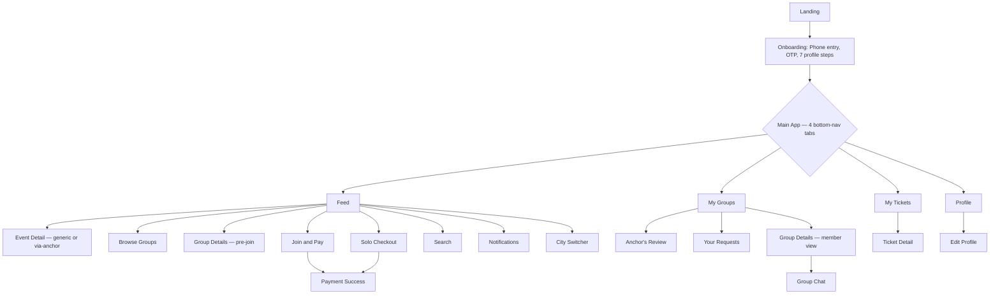
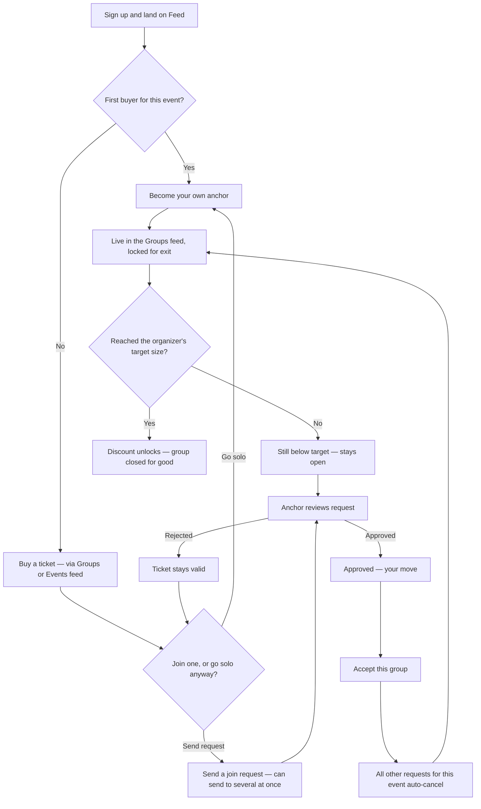

# Cirkle Design bible

  [https://claude.ai/code/artifact/7a4854ca-2717-4380-8c05-6edf654968b9?via=auto_preview](https://claude.ai/code/artifact/7a4854ca-2717-4380-8c05-6edf654968b9?via=auto_preview)

  Follow this design strictly . 

# Swagger Api documentation

[http://localhost:3000/api-docs/](http://localhost:3000/api-docs/)

# Cirkle — Product Specification

**Version:** 1.0 — Attendee-side complete
**Scope:** Attendee experience only. Organizer dashboard, admin/ops tooling, and database schema are out of scope for this document.
**Audience:** Engineering team building the attendee-facing product.

---

## 1. What Cirkle Is

Cirkle is a social layer on top of event ticketing. The core idea: nobody should have to attend an event alone, and nobody should have to coordinate a group *before* committing to go. On Cirkle, buying a ticket is what starts the social process, not the other way around.

Launch market: Delhi NCR, India. Event types: club nights, concerts, community trips, social mixers.

---

## 2. Core Concepts (read this before anything else)

These five rules are the foundation of the entire product. Every screen in this document exists to serve one of them.

### 2.1 Payment always comes first, unconditionally

A person can only ever do one thing first: **buy a ticket**. There is no way to "reserve a spot," "request to join," or otherwise act on an event without first paying for your own ticket to it. This is true whether you arrived through the Events tab or by tapping "Join me" on someone's group card.

### 2.2 A "group" is not created — it is seeded by a ticket purchase

There is no "Create Group" form anywhere in the product. The moment a person buys a ticket to an event with no group already in mind, their own existing profile (photo, name, age, lifestyle tags — all already collected at onboarding) becomes a card in the Groups feed for that event, with a single "Join me" button. No extra input is required from them — no group name, no tagline, no vibe selector.

The person whose ticket originated a group this way is called the **anchor**.

### 2.3 The anchor has sole, permanent approval authority

Only the original anchor of a group can approve or reject join requests to that group — for the entire lifetime of the group, no matter how large it grows. A member who joined later never gains approval rights.

### 2.4 Once a group has 2 or more people, no one can ever leave

This includes the anchor. The lock applies the moment a group crosses from 1 person to 2, even if the group is still well below its target size and still accepting new joiners. Growth can continue; exit cannot happen, for anyone, ever.

This is the direct structural fix for the "flaky friend cancels last-minute" problem — once a group locks, it cannot fragment.

### 2.5 The organizer sets the target size; hitting it unlocks the discount and closes the group

Each event has an organizer-defined group size (set at event creation, out of scope for this document). The instant a group reaches exactly that size, a discount unlocks for every member, and the group permanently stops accepting new members. The very next solo buyer for that same event becomes the anchor of a brand-new group. Multiple groups can exist in parallel for the same event at any time.

---

## 3. Onboarding & Authentication

### 3.1 Landing

- Entry screen, shown to anyone not yet signed in.
- Two actions: **Create account** (begins sign-up) and **Log in** (existing users go straight to the Feed).
- No content requires the user to be logged in to view this screen.

### 3.2 Phone entry

- Single field: phone number, India only (+91 prefix fixed).
- Validation: 10 digits, must start with 6, 7, 8, or 9 (standard Indian mobile number format).
- Action: **Send OTP** → navigates to OTP verification.
- Back arrow returns to Landing.

### 3.3 OTP verification

- 6 individual digit boxes, auto-advances focus to the next box as each digit is typed.
- Backspace on an empty box moves focus to the previous box.
- A 30-second countdown before "Resend code" becomes available.
- On successful verification → proceeds to onboarding step 1 (Name) for new users, or directly to the Feed for returning users whose phone number is already registered.
- Back arrow returns to Phone entry.

### 3.4 Profile setup — 7 mandatory steps

Each step is its own full screen with a progress bar (`step / 7`) and a back arrow that returns to the previous step. All 7 must be completed before reaching the Feed for the first time; none can be skipped.

| Step              | Field(s)                                                                                                                                 | Validation                                                                       | Notes                                                                                                                                                         |
| ----------------- | ---------------------------------------------------------------------------------------------------------------------------------------- | -------------------------------------------------------------------------------- | ------------------------------------------------------------------------------------------------------------------------------------------------------------- |
| 1. Name           | First name, last name                                                                                                                    | Both required, minimum 2 characters each                                         | Displayed publicly as "FirstName, Age" everywhere on the platform                                                                                             |
| 2. Date of birth  | Day / Month / Year selectors                                                                                                             | Must calculate to 18 years or older                                              | Under-18 blocks progress with an explicit message; age (not DOB) is what's shown publicly                                                                     |
| 3. Gender         | Single select: Man / Woman / Non-binary / Prefer not to say                                                                              | One must be selected                                                             | Used only for display and as context for the anchor's approval decisions — not used as a structural filter anywhere (see §18.4)                               |
| 4. City           | Search-select from a fixed list of 15 Indian cities                                                                                      | One must be selected                                                             | Determines which events and groups the person sees everywhere in the app                                                                                      |
| 5. Lifestyle tags | Multi-select from ~10–12 tags across categories (Going out, Active & outdoors, Travel & experiences, Arts & culture, Social & community) | Minimum 3 selected                                                               | These are the tags shown on every group/anchor card and on the public profile — equivalent to "interests" on a dating app, repurposed for event compatibility |
| 6. Photos         | 2–4 photo uploads                                                                                                                        | Minimum 2 required; first photo is tagged "Main" and must show the person's face | These photos are what appears on the anchor card in the Groups feed                                                                                           |
| 7. Email          | Single email field                                                                                                                       | Valid email format required                                                      | Used only for ticket delivery and reminders — **never** used for login                                                                                        |

- Completing step 7 ("Finish setup") takes the user directly into the Feed.

---

## 4. App Navigation Structure

Once onboarded, the app has **4 persistent bottom-navigation tabs**, each a root of its own navigation stack:

1. **Feed** — discovery (Groups tab + Events tab)
2. **My Groups** — every group relationship the person currently has, across all events
3. **My Tickets** — every ticket the person has purchased, regardless of group status
4. **Profile** — account settings hub

Switching tabs resets that tab's navigation to its root screen; it does not preserve a "back stack" from a previous visit to that tab. Sub-screens reached by drilling into a tab (e.g., Event Detail from the Feed) use a standard back-arrow-returns-to-previous-screen pattern.

---

## 5. The Feed

Reached via the Feed tab. Has its own header (separate from the screen content below it) and two sub-tabs.

### 5.1 Header (persistent across both Feed sub-tabs)

- App wordmark, left-aligned.
- City pill (current city, e.g. "Delhi NCR") — tapping opens the City Switcher.
- Search icon — opens Search.
- Notifications bell icon — opens Notifications.

### 5.2 Groups tab (default sub-tab)

Shows a feed of **anchor cards** — one card per group still open to new members, for events relevant to the person's city. Each card shows:

- Anchor's main photo
- Anchor's name and age
- Anchor's tagline (if any was set — see §18.3 on what an anchor can and cannot set)
- An event strip (event name, date, venue, price) showing which event this card is for
- "N people going so far" with current spots filled
- **Three actions** (see §9 below for full detail on what each leads to):
  - **View group** — opens Group Details for this anchor's group
  - **View event** — opens Event Detail, in its "via this anchor" state (see §6.2)
  - **Join me** — the primary action button, full-width below the other two

### 5.3 Events tab

- Filter chips across the top: All / Clubs / Concerts / Trips / Meetups.
- A vertically-scrolling feed of event cards (not group cards). Each shows: event type badge, price, name, date, venue, a count of how many groups are currently forming for it, and a "View groups" shortcut.
- Tapping an event card (anywhere except a specific sub-action) opens Event Detail in its **generic** state (§6.1) — no anchor is implied, because none was selected.

---

## 6. Event Detail

This single screen has **two distinct states**, depending on how the person arrived. Getting this distinction right matters — showing the wrong state misleads the person about what they're looking at.

### 6.1 Generic state (no group context)

**Reached when:** the person tapped an event card directly from the Events tab, or from Search results, i.e. they were browsing events, not a specific person's group.

**Find your tribe section shows:**

- "Find your tribe" heading
- A short count ("N groups are already forming for this event")
- A single **Browse groups** button → opens Browse Groups for this event

No anchor's name or photo appears anywhere on this screen in this state.

### 6.2 Via-anchor state (arrived through a specific group's card)

**Reached when:** the person tapped "View event" on a specific anchor's card in the Groups feed.

**Find your tribe section instead shows:**

- "You're viewing this via" label
- That specific anchor's photo, name, and current spots-filled status
- A **Join me** button, tied to that specific anchor (same behavior as §9)
- A secondary "Browse other groups for this event" link, as a fallback if the person decides this particular anchor's group isn't for them

### 6.3 Elements common to both states

- Banner image area, event type badge
- Event name, date, time, venue
- Price, and a **"Join this event"** button — this is the **plain solo ticket purchase**, completely independent of any group (see §13 Solo Checkout). This button exists in both states and behaves identically in both — it never implies any group.
- About section (event description)

---

## 7. The Core Mechanic — Group Formation, Approval, and Locking

This is the most important section of this document. Read it fully before building any of the screens in §9–10.

### 7.1 Becoming the first anchor for an event

If no group exists yet for an event, the first person to buy a ticket for it (via the Events tab, since there's nothing in the Groups feed yet to tap "Join me" on) automatically becomes that event's first anchor. They set nothing extra — their existing onboarding profile plus the event they bought a ticket for is the entire content of their card.

### 7.2 Every subsequent buyer has exactly two routes to a ticket

For any event that already has at least one group forming:

- **Route A:** tap "Join me" on an existing anchor's card in the Groups feed → if the person doesn't yet have a ticket to that event, they're taken through payment first (§9.3); once they have a ticket (immediately, or because they already had one), a join request is sent automatically to that anchor.
- **Route B:** buy a ticket independently via the Events tab, with no anchor in mind → afterward, browse Browse Groups and choose whether to request to join an existing group, or remain a solo anchor of their own.

Both routes converge on the same underlying rule: **pay first, decide on a group second.**

### 7.3 Sending a join request

- A join request can only be sent by someone who already holds a valid ticket to that specific event.
- **A person may send join requests to more than one group for the same event at the same time.** This is allowed and expected — for example, someone might request to join three different groups while waiting to see which one accepts them.
- Sending a request never costs anything extra and never affects the person's ticket.

### 7.4 Anchor review

- Only the anchor of a given group can see and act on join requests to that group.
- For each pending request, the anchor sees the requester's name, age, a couple of their lifestyle tags, and an explicit confirmation that the requester already holds a valid ticket to the event (so the anchor never has to wonder about that).
- Two actions: **Accept** or **Decline**.
- Declining has no consequence for the requester's ticket — it remains valid regardless.

### 7.5 Acceptance is not final until the requester confirms it

This is a deliberate two-step handshake, not a single approval:

1. The anchor accepts a request → the request's status changes to **"Approved — your move."** The requester is **not** yet a member of the group.
2. The requester must explicitly **accept** that specific group from their own "Your requests" view.
3. The moment the requester accepts one group, they are locked into it, and **every other outstanding request they have sent for that same event — whether still pending or already separately approved by another anchor — is automatically cancelled.**

Why this exists: if a person requested to join several groups and more than one anchor says yes, the person — not whichever anchor happened to respond first — gets to choose which group they actually join.

### 7.6 The permanent lock-in

The moment a requester accepts a group (per §7.5), that group now has 2+ members, and per §2.4, no one in it — including the anchor — can ever leave. This is true even if the group is still well short of the organizer's target size.

### 7.7 Growth continues until the target is hit

A group below its target size keeps appearing in the Groups feed and keeps accepting new join requests, each going through the same review-then-accept handshake described above.

### 7.8 Hitting the target size

The instant a group's member count equals the organizer's pre-set target for that event:

- The discount unlocks for every current member.
- The group is permanently closed — no further join requests can be sent to it, ever.
- The next person who buys a solo ticket to that same event (with no group chosen) becomes the anchor of a fresh, brand-new group.

---

## 8. Browse Groups

Reached from Event Detail (either state) via "Browse groups" / "Browse other groups for this event."

- Header shows the specific event this page is for.
- A stats row: total groups forming, total people attending, total open spots across all groups.
- Filter chips (e.g. "All," "Open").
- A list of group cards (same visual format as the Groups feed cards), each with a **"Request to join"** button instead of "Join me" — functionally identical to §9, just labeled differently because the person is already deliberately browsing rather than encountering one card at a time.
- A group that has already hit its target size shows as visually dimmed with a disabled **"Group is full"** state instead of a request button.
- **There is no "Create your own group" button on this page.** Creating a group is never a deliberate action anywhere in the product — it only ever happens automatically, per §7.1, by buying a ticket with no group in mind via the Events tab.

---

## 9. Joining a Group — The "Join Me" Action, Fully Specified

"Join me" appears in **three places**: directly on a Groups-feed card, on the Group Details screen (§10), and inside the via-anchor Event Detail state (§6.2). **The behavior is identical regardless of which of the three it's tapped from.**

### 9.1 If the person already holds a valid ticket to that event

Tapping "Join me" sends the join request **immediately** — no extra screen. The button's label changes in place to "Request sent" and a brief confirmation toast appears. The person can continue browsing and may still tap "Join me" on other groups for the same event (per §7.3).

### 9.2 If the person does not yet hold a ticket to that event

Tapping "Join me" opens a dedicated **Join & Pay** screen containing:

- **"You're requesting to join"** section — the target anchor's mini profile (photo, name, age) and current spots-filled status.
- **"For this event"** section — event name, date, venue, and ticket price.
- A single combined action button: **"Pay ₹[price] & send request."**

From the person's perspective, paying and requesting happen as one action. Underneath, payment completes first and the join request fires immediately afterward, automatically, with no separate confirmation step.

### 9.3 Group Details screen (the "View group" destination)

Shown when tapping "View group" on a card, before joining. Contents:

- Anchor's photo, name, age, and tagline (centered hero layout).
- **Members section:** a spots-filled bar (e.g. "1 of 4 spots filled"), the anchor listed first with an "Anchor" tag, and any remaining open spots shown as empty dashed placeholder circles.
- **Event section:** a compact strip showing which event this group is for.
- A sticky **Join me** button pinned to the bottom of the screen, behaving exactly per §9.1/§9.2.

### 9.4 Payment success

Shown immediately after completing payment, whether through Join & Pay (§9.2) or Solo Checkout (§13). **The message shown must match the actual context:**

- If payment was completed as part of a Join & Pay flow (a specific anchor was targeted): "Your ticket is confirmed, and your request has been sent to [Anchor name]. You'll be notified once they respond."
- If payment was completed through Solo Checkout (no anchor involved at all): "Your ticket is confirmed. You can look for a group to join anytime from My Tickets."

This screen must have a normal back arrow (returning to the Feed) like every other screen, plus two explicit forward actions: **Back to feed** and **View my tickets.** It must never be a dead end with only one easily-missed button.

---

## 10. Anchor's Review Screen ("My Group")

This is what an anchor sees to manage their own group. Reached from a "My Groups" card where the person is the anchor (§11).

- Header: which event this group is for.
- **Members section:** spots-filled bar and a list of current members (anchor always listed first, tagged "You're the anchor").
- **Pending requests section:** a count badge, and one card per pending request showing the requester's photo, name, age, a couple of their lifestyle tags, an explicit "Has a ticket to this event" confirmation badge, and **Accept / Decline** buttons.
- Accepting a request here does **not** immediately add the person to Members (per §7.5 — it changes their request to "Approved — your move," visible from the requester's own "Your requests" screen). The anchor's Members list and spots bar only update once the requester separately confirms acceptance.
- A persistent reminder note: "Once your group has 2 or more people, no one can leave — including you."
- If there are zero pending requests, the section simply reads "No pending requests yet" with no further action available.

---

## 11. "Your Requests" Screen (the requester's side of §7.5)

This is what a person sees for any event where they've sent one or more join requests that haven't yet resolved into membership.

- Header: which event these requests are for.
- An info banner explaining the rule: "You can request to join more than one group. Once you accept one, the rest cancel automatically."
- One card per outstanding request, each in one of three states:
  - **Waiting on [anchor]** — anchor hasn't responded yet. No action available.
  - **Approved — your move** — highlighted/glowing card, with an **"Accept & join this group"** button.
  - **Declined** — dimmed, no action, no effect on the person's other requests.
- Tapping **Accept** on an approved card:
  - That card's status changes to **"Locked in for good."**
  - Every other card for that same event (regardless of its prior state — pending or approved) immediately flips to **"Cancelled"** with a small note ("You joined another group").
  - A confirmation toast appears: "You're in [Anchor]'s group! Your other request(s) were cancelled."

---

## 12. My Groups Tab

The single place that surfaces **every group relationship** a person currently has, across every event, regardless of role. One card per relationship.

### 12.1 The list

- Filter chips: **All / Hosting / Joined / Pending** — splitting the same underlying list by role.
- Each card shows the event (icon, name, date, venue) and a role badge, then content specific to that role:

| Role                                | Card shows                                                                                                                               | Tapping the card opens                               |
| ----------------------------------- | ---------------------------------------------------------------------------------------------------------------------------------------- | ---------------------------------------------------- |
| **Anchor, with pending requests**   | Spots-filled bar + a highlighted "N pending requests" button                                                                             | Anchor's Review screen (§10)                         |
| **Anchor, nothing pending**         | Spots-filled bar, plain "No pending requests yet" text, no button                                                                        | Anchor's Review screen (§10), showing an empty queue |
| **Member, group already locked**    | A "Locked · discount unlocked" badge                                                                                                     | Group Details — member view (§12.2)                  |
| **Requests sent, not yet resolved** | Small avatars of who's been asked, a one-line status (e.g. "Karan approved you — 1 more pending"), and a highlighted "Decide now" button | Your Requests screen (§11)                           |

A single person can simultaneously be the anchor of one event's group, a locked-in member of another event's group, and have unresolved requests out for a third event — the list simply shows one card per relationship.

### 12.2 Group Details — member view

A different screen from §9.3 (the pre-join Group Details), shown to someone who is **already a locked-in member**, not someone deciding whether to join.

- Header: the event this group is for.
- A prominent **"You're locked in"** hero state with a lock icon and "Discount unlocked for everyone here."
- Full members list, anchor tagged.
- A link/button into **Group Chat** (§14) for this group.
- No "Join me" button anywhere on this screen — there is nothing left to decide.

---

## 13. Solo Checkout

The plain ticket-purchase screen, used when someone buys via the Events tab with **no group context at all** (i.e., reached via "Join this event" on Event Detail, or directly from an Events-tab card with no group attached).

- Event summary (name, date, time, venue).
- A **fixed, non-editable** "Tickets: 1 — just for you" indicator. There is no quantity selector anywhere in Cirkle, on any checkout screen, for any route — every booking is always exactly one ticket, for the person buying it. This must never be implemented as an editable stepper.
- An explanatory note: "Every Cirkle booking is one ticket for yourself. You can look for a group to join after you pay."
- Standard price breakdown (ticket price + convenience fee = total).
- A single **"Pay ₹[total]"** button → leads to Payment Success in its **generic** state (§9.4).

---

## 14. My Tickets Tab

The transactional record of every ticket a person has purchased — **deliberately and completely independent of group status.**

### 14.1 Why this separation matters

A ticket is valid proof of purchase and an entry credential, full stop, regardless of whether the person ended up solo, in a still-forming group, or in a locked group. Showing any group-related information on this tab — hosting status, pending counts, lock state — would wrongly imply that owning a ticket is somehow conditional on a group outcome. It is not. **No card or screen in My Tickets may reference group/anchor/member status in any form.**

### 14.2 The list

- Filter: Upcoming / Past.
- One card per ticket, styled like a tear-off stub: top half is pure logistics (event icon, name, date, time, venue); a dashed perforation line; bottom half is a "View ticket & entry QR" prompt with a chevron.

### 14.3 Ticket Detail

Tapping any ticket opens:

- A small banner matching the event's category.
- Event name, date, time, venue.
- A large QR code block with a booking reference printed beneath it ("Show this at the entrance").
- Three plain facts: Ticket holder ("You"), Price paid, Booking date.

Nothing else. No group information appears anywhere on this screen.

---

## 15. Group Chat

Reached from the member-view Group Details screen (§12.2), or from a Notifications row, or from the info icon inside the chat header itself (which opens the Anchor's Review screen if the viewer is the anchor).

- Header: stacked avatars of all members, a combined name list, member count, and "locked in" status.
- A pinned event strip directly below the header (event name, date, venue) so the conversation never loses context of what it's for.
- Message thread, mixing:
  - **System messages** narrating the actual mechanics as they happened — e.g. "Rahul joined the group," "Group locked in — discount unlocked, everyone saves 20%." These are real events from the group's history, not generic chat-app filler.
  - **Regular chat bubbles**, left-aligned for other members (each labeled with their name), right-aligned and distinctly colored for the viewer's own messages.
- A standard text input + send button at the bottom. Sending appends a new right-aligned bubble immediately.

---

## 16. Notifications

Reached from the bell icon in the Feed header.

- Grouped by day ("Today," "Yesterday," etc.), most recent first.
- Each row has an icon, a description (with the relevant person's name bolded where applicable), and a relative timestamp.
- Unread rows are visually distinguished (subtly highlighted background + a small dot).
- **Every notification type maps to a real mechanic and should deep-link to the relevant screen:**

| Notification                                               | Deep-links to                               |
| ---------------------------------------------------------- | ------------------------------------------- |
| "[Anchor] approved your request"                           | Your Requests (§11)                         |
| "[Person] sent a request to join your group"               | Anchor's Review screen (§10)                |
| "[Person] sent a message in [group chat]"                  | Group Chat (§15)                            |
| "Your group is locked in — discount unlocked"              | Group Details — member view (§12.2)         |
| "[Person]'s request declined — your ticket is still valid" | (no deep link needed; purely informational) |

A "Mark all read" action sits in the header.

---

## 17. Search

Reached from the search icon in the Feed header.

- A persistent search input at the top, with a back arrow.
- Quick filter chips (Clubs / Concerts / Trips, etc.) beneath it.
- Results split into two clearly labeled sections:
  - **Events** — each result opens Event Detail in its **generic** state (§6.1), since arriving via search implies no specific anchor was chosen.
  - **Groups** — each result opens that group's pre-join Group Details (§9.3).

---

## 18. City Switcher

Reached by tapping the city pill in the Feed header.

- Full screen (not a dropdown), since changing the active city reshapes both Feed sub-tabs entirely — this deserves a deliberate, full-attention moment rather than a quick menu tap.
- A search field to filter the fixed list of cities.
- A simple list; the currently active city shows a checkmark. Tapping a different city moves the checkmark there (selection is held client-side until the person navigates away, at which point the new city becomes active across the whole app).

---

## 19. Profile Tab (Account Hub)

This is **not** the rich profile shown to others (that content lives on the anchor card and is edited via §20) — this is a simple, functional account-management screen.

- Header: profile picture, name, and an **Edit profile** button (→ §20).
- **Help and support** section: Check for updates, Contact us, Manage account.
- **Legal** section: Privacy policy, Terms of use, Safety guidelines.
- **Log out** button at the bottom, visually distinct (outlined in a muted red/pink tone) from the rest of the screen, since it's a more consequential action than the list rows above it.

---

## 20. Edit Profile

Reached from the Edit profile button on the Profile tab.

- **Photos:** the same 2–4 photo grid established at onboarding (§3.4 step 6), with the same minimum-2 / first-photo-tagged-Main rules. Each filled slot can be removed; empty slots can be filled.
- **Name fields:** editable, same validation as onboarding.
- **Phone number row:** shown but explicitly **locked** with a padlock indicator and a note ("Phone number used to sign in") — this field can never be edited here, since it's the login credential, not a profile attribute.
- **About you (bio):** free text, with a character counter.
- **My vibe (lifestyle tags):** the same tag set from onboarding, with the same minimum-3 rule enforced — if a save attempt would drop below 3 tags, the count indicator turns red and the save should be blocked.
- A **Save** action in the top-right corner of the header (not a separate full-width button at the bottom of the scroll).

---

## 21. Cross-Cutting Rules (do not violate these in any screen)

These rules apply across multiple screens and are easy to accidentally break when building one screen in isolation. Check every new screen against this list.

1. **Every booking is exactly one ticket, always, regardless of route.** No quantity selector should ever appear, anywhere.
2. **Payment and group membership are fully decoupled in the data model and must stay decoupled in the UI.** My Tickets never shows group status; My Groups never shows ticket/payment details.
3. **There is no "Create Group" affordance anywhere in the product.** Any screen that implies a deliberate group-creation action (a form with a name/tagline/vibe field, a "Create group" button) is wrong and should be corrected to the automatic-seeding model in §7.1.
4. **No "Leave group" affordance may ever appear once a group has 2 or more members** — not for the anchor, not for any other member. This applies even to groups still below their target size.
5. **Only the original anchor of a group can ever approve or decline requests to it**, for the group's entire lifetime, regardless of how many members it gains.
6. **Anchor approval is never the final step.** The requester must separately accept (§7.5) before they're actually a member. Don't shortcut this into a single-step "anchor accepts = instantly a member" flow.
7. **Accepting one approved/pending request must cancel every other outstanding request the same person has for the same event**, regardless of those other requests' individual states.
8. **Event Detail must always reflect how the person actually arrived** — generic state for direct browsing (Events tab, Search), via-anchor state only when a specific group's card was the entry point. Never hardcode one state as the default for both.
9. **Payment Success must reflect which flow led to it** — mentioning a specific anchor only when one was genuinely involved (Join & Pay), and staying generic for Solo Checkout. Never hardcode a specific anchor's name into a screen reachable from more than one flow.
10. **Gender, while collected at onboarding, is never used as a structural join filter.** There is no "women only" / "men only" toggle anywhere in the group-joining flow. The anchor's individual discretion during approval (§7.4) is the entire safety mechanism for who joins a group.
11. **Browse Groups has no group-creation entry point.** Its only actions are requesting to join existing groups.
12. **Every screen needs a working way out.** A screen with only one button, or no back arrow, is a bug — confirm every screen has either a back arrow returning to its logical previous screen, or (for the 4 tab roots) is itself a safe landing point.

---

## 22. Complete Screen Inventory

| #    | Screen                         | Reached from                                                     | Has back arrow to   |
| ---- | ------------------------------ | ---------------------------------------------------------------- | ------------------- |
| 1    | Landing                        | App launch (logged out)                                          | —                   |
| 2    | Phone entry                    | Landing → Create account                                         | Landing             |
| 3    | OTP verification               | Phone entry                                                      | Phone entry         |
| 4–10 | Profile setup steps 1–7        | OTP (step 1); each step → next                                   | Previous step       |
| 11   | Feed (Groups tab / Events tab) | Onboarding complete; bottom nav                                  | — (tab root)        |
| 12   | Event Detail (generic)         | Events tab card; Search result                                   | Feed                |
| 13   | Event Detail (via-anchor)      | "View event" on a group card                                     | Feed                |
| 14   | Browse Groups                  | Event Detail (either state)                                      | Event Detail        |
| 15   | Group Details (pre-join)       | "View group" on a group card; Search result                      | Feed / Search       |
| 16   | Join & Pay                     | "Join me" with no ticket held                                    | Previous screen     |
| 17   | Payment Success                | Completing payment (either flow)                                 | Feed                |
| 18   | Anchor's Review ("My Group")   | My Groups card (anchor role); Notification; Group Chat info icon | My Groups           |
| 19   | Your Requests                  | My Groups card (awaiting role); Notification                     | My Groups           |
| 20   | My Groups                      | Bottom nav                                                       | — (tab root)        |
| 21   | Group Details (member view)    | My Groups card (member role); Notification                       | My Groups           |
| 22   | My Tickets                     | Bottom nav; Payment Success shortcut                             | — (tab root)        |
| 23   | Ticket Detail                  | My Tickets card                                                  | My Tickets          |
| 24   | Group Chat                     | Group Details (member view); Notification                        | Previous screen     |
| 25   | Solo Checkout                  | "Join this event" on Event Detail; Events-tab card with no group | Event Detail / Feed |
| 26   | Notifications                  | Bell icon in Feed header                                         | Feed                |
| 27   | Search                         | Search icon in Feed header                                       | Feed                |
| 28   | City Switcher                  | City pill in Feed header                                         | Feed                |
| 29   | Profile (account hub)          | Bottom nav                                                       | — (tab root)        |
| 30   | Edit Profile                   | "Edit profile" on Profile tab                                    | Profile             |

---

## 23. Appendix: Flowcharts

These are provided as Mermaid diagrams — paste either block into [the Mermaid Live Editor](https://mermaid.live), or view this file directly in GitHub, GitLab, Obsidian, or VS Code (with the Mermaid extension), all of which render Mermaid blocks visually inline.

### 23.1 Complete screen sitemap

### 23.2 The core mechanic — ticket to lock-in to discount

This is the full logic described in §7, as a single flow.

**Reading notes for both diagrams:**

- In 23.2, the loop from "Ticket stays valid" back to the join-or-solo decision represents §7.3 — a rejected requester can try a different group or settle for being their own anchor; their ticket is never at risk.
- The loop from "Still below target" back to "Anchor reviews request" represents §7.7 — a group keeps cycling through new join requests until it hits its target size.
- The "All other requests... auto-cancel" step is §7.5 — this is the step most likely to be under-built if implemented from intuition alone, since it's easy to assume anchor-approval alone is the finish line.

---

*End of specification.*